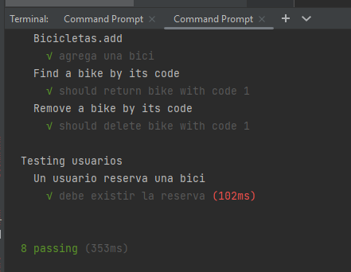

# Actividad Bicis

# Install all the dependencies
`npm i`

# Run Test
This project uses Mocha for testing

`npm run mochatest`

# Run project

## Run on localhost
`npm start`
or
`npm devstart`   
Then go to [localhost:3000](https://localhost:3000)
In this interface you can add, update, delete or get a bicycle.
You can also create new users and get verification with tokens

echo "# ActividadBicis" 
